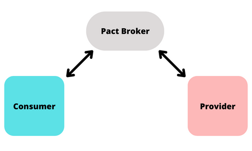

<div align="center">
  <h1>Teste de Contrato com Pact</h1>
</div>
<br>


# Descrição

Esse repositorio tem como objetivo exemplificar de uma forma simples e prática a execução dos testes de contrato com 
Pact utilizando linguagens diferentes para cada aplicação. 


# Fluxo

O fluxo utilizado é o mais simples possível para realizar a comunicação dos testes do provider e consumer. 
Ele está longe de ser o ideal para ser usado em produções de software! 
Caso deseje um fluxo completo para sua aplicação recomendo o 
[Nirvana para teste de contrato](https://github.com/PauloGoncalvesBH/nirvana-teste-de-contrato) que faz uso de CI para as etapas de verificação.  



## Pact Broker
O [Pact Broker](docker-compose.yml) é o responsável pela comunicação entre os sistemas, garantido a execução dos testes 
em ambos os lados. Sendo assim, o consumer envia o contrato contendo as informações que ele espera receber em uma determinada rota
e o provider baixa esse contrato, executa-o localmente verificando se os dados estão sendo enviados da forma esperada e devolve
os resultados do teste para o Pact Broker.

### Pré-requisitos
- [Docker](https://docs.docker.com/get-docker/)
- [Docker-compose](https://docs.docker.com/compose/install/)

### Executar Pact Broker
 ```
docker-compose up
 ```

## Consumer
O [consumer](./consumer) é a aplicação que consome a API, é o resposável por fazer a requisições dos dados para o provider. 

#### Pré-requisitos
- Node JS
- npm

### Instalar
 ```
 npm install
 ```
### Executar os testes
 ```
 npm run test:consumer
 ```
### Publicar o contrato
 ```
 npm run pact:publish
 ```

## Provider
O [provider](./provider) é a aplicação que promove a API, é o responsável por enviar os dados requisitados pelo consumer.

#### Pré-requisitos
- PHP
- composer

### Instalar
 ```
 composer install
 ```
 
### Subir a aplicação
 ```
 php -S localhost:8000
 ```

### Executar os testes
 ```
vendor/bin/phpunit
 ```
